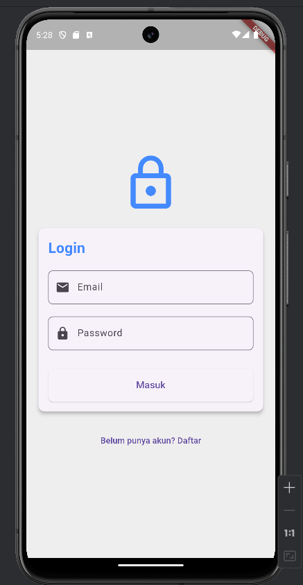
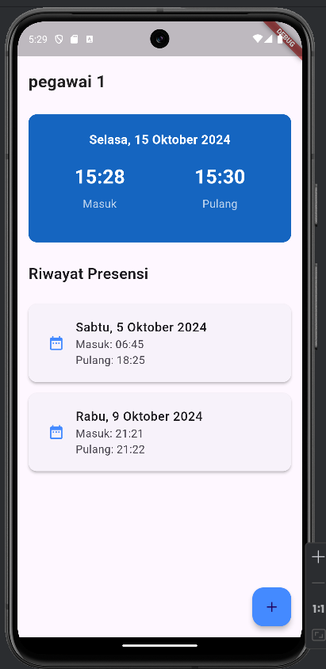
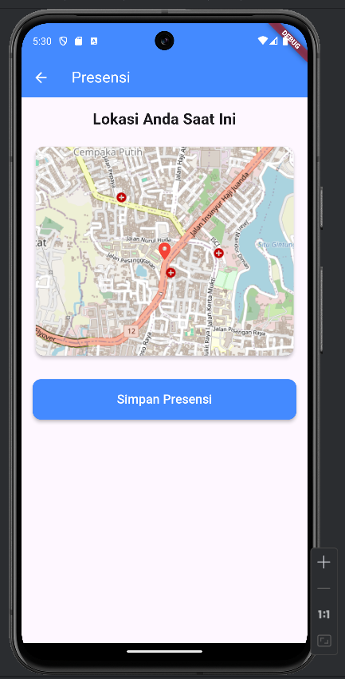

# Aplikasi Presensi Flutter + Laravel

Ini adalah aplikasi presensi yang dibangun menggunakan Flutter untuk frontend dan Laravel untuk backend. Aplikasi ini memungkinkan pengguna untuk mencatat kehadiran mereka melalui perangkat mobile dan menyimpan data tersebut ke server yang dibangun dengan Laravel.

## Fitur

- **User Authentication**: Sistem login dan register menggunakan token JWT.
- **Presensi**: Pengguna dapat melakukan check-in dan check-out presensi.
- **Geolocation**: Menggunakan lokasi GPS untuk memvalidasi tempat presensi.
- **Riwayat Presensi**: Melihat riwayat presensi sebelumnya.
- **Notifikasi**: Pengingat untuk melakukan check-in dan check-out presensi.
- **Admin Panel (Laravel)**: Melihat data presensi semua pengguna, mengelola pengguna, dan mengelola pengaturan aplikasi.

## Tech Stack

### Frontend (Flutter)

- **Dart**: Bahasa pemrograman utama untuk pengembangan aplikasi Flutter.
- **Flutter**: Framework UI untuk membangun aplikasi mobile.
- **http**: Digunakan untuk melakukan request API ke backend Laravel.
- **Geolocator**: Untuk mendapatkan data lokasi saat melakukan presensi.
- **SharedPreferences**: Untuk menyimpan data user session secara lokal.

### Backend (Laravel)

- **PHP 8.x**: Bahasa utama untuk backend menggunakan framework Laravel.
- **Laravel 9.x**: Framework untuk mengelola backend API.
- **MySQL**: Database untuk menyimpan data pengguna dan presensi.
- **JWT Authentication**: Untuk mengelola autentikasi pengguna.
- **Laravel Passport**: Mengelola OAuth2 dan API token untuk autentikasi.

## Instalasi

### Backend (Laravel)

1. Clone repository Laravel:
   ```bash
   git clone https://github.com/DaffaMalik12/presensi-backend.git
   cd presensi-backend
   ```

2. Install dependencies:
   ```bash
   composer install
   ```

3. Buat file `.env` dari template:
   ```bash
   cp .env.example .env
   ```

4. Atur konfigurasi database di file `.env`:
   ```env
   DB_CONNECTION=mysql
   DB_HOST=127.0.0.1
   DB_PORT=3306
   DB_DATABASE=presensi_db
   DB_USERNAME=root
   DB_PASSWORD=your_password
   ```

5. Generate app key:
   ```bash
   php artisan key:generate
   ```

6. Migrate database:
   ```bash
   php artisan migrate
   ```

7. Jalankan server Laravel:
   ```bash
   php artisan serve
   ```

### Frontend (Flutter)

1. Clone repository Flutter:
   ```bash
   git clone https://github.com/DaffaMalik12/presensi-Flutter.git
   cd presensi-Flutter
   ```

2. Install dependencies:
   ```bash
   flutter pub get
   ```

3. Atur base URL API Laravel di file `lib/services/api_service.dart`:
   ```dart
   static const String baseUrl = 'http://127.0.0.1:8000/api/';
   ```

4. Jalankan aplikasi Flutter:
   ```bash
   flutter run
   ```

## Penggunaan

1. **Login**: Pengguna harus login dengan email dan password yang telah terdaftar.
2. **Presensi**: Setelah login, pengguna dapat melakukan check-in dengan menekan tombol "Check In". Lokasi akan divalidasi menggunakan GPS.
3. **Check-out**: Pengguna dapat melakukan check-out presensi di akhir hari kerja.
4. **Riwayat**: Pengguna dapat melihat riwayat presensi di halaman "Riwayat".

## API Endpoints (Laravel)

- **POST** `/api/login`: Login user.
- **POST** `/api/register`: Registrasi user.
- **POST** `/api/presensi/checkin`: Check-in presensi.
- **POST** `/api/presensi/checkout`: Check-out presensi.
- **GET** `/api/presensi/history`: Mendapatkan riwayat presensi user.

## Kontribusi

1. Fork repository ini.
2. Buat branch baru: `git checkout -b fitur-baru`.
3. Commit perubahan Anda: `git commit -m 'Menambahkan fitur baru'`.
4. Push ke branch: `git push origin fitur-baru`.
5. Buat Pull Request.

## Preview




## Lisensi

Aplikasi ini dilisensikan di bawah lisensi MIT. Lihat file [LICENSE](LICENSE) untuk detail lebih lanjut.

